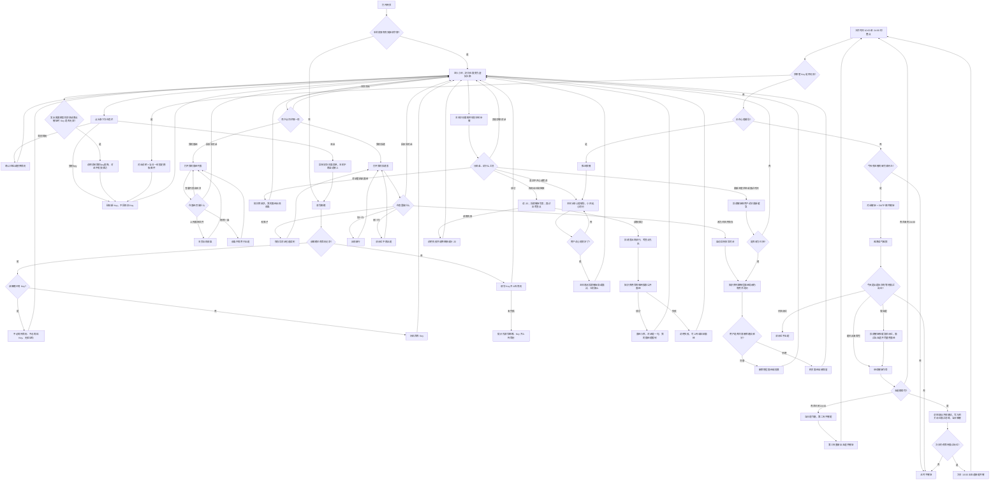

# 面试陪伴 Agent（offer_coming）
status: Confirmed  
2026-09-15 用户确认：今日五题对用户只展示五道题干；题目分配、优先级、考查点等到答完点评时再给。邮件只催促并附上五题，不写进度表或考查点。  
2026-09-15 用户确认：出题日合计五题（默认 3 道简历深挖 + 2 道业务场景）。  
2026-09-15 用户确认：小凹对用户说的话一律流式出字；文字出现前须有缓冲提示「小凹正在思考...」，不能空白干等。  
2026-09-15 用户确认：先限制对外回复长度，再收短主体 prompt。  
2026-09-15 用户确认：对话需要上下文记忆，否则无法做类似面试里的追问。  
2026-09-15 用户确认：「我投递了这个岗位」这类说法就必须写入投递表，不要等「请补录」；没说进度则追问。投递状态在等待面试、已挂之外增加简历筛选中、简历挂、待测评、已测评、一面、二面、三面。

## 用户目标与完整流程

求职者本人使用网页，先填写收件邮箱、粘贴自己的百炼 Key 并上传简历，然后与「小凹」对话，在「我的投递」里查看和改投递表，在「我的面经」里查看已收录的面经列表和正文。关掉网页再打开时，接上同一份简历、投递记录、知识库、已保存的 Key、当日任务和最近对话。对话、出题、催促文案和公开面经检索都使用该求职者自己的 Key，不使用运营方 Key 代付。仅百炼，用户不选其他厂商、不填五个模型名。产品不做完整模拟面试场次（不另开整场对练），但同一条对话里小凹必须能接上最近几轮，讲解或辅导时可以就用户上一句追问。后台是一个主体大模型加四个子 Agent，各调不同大模型：主体负责识别意图、规划步骤、调用子 Agent 和工具；投递催促子 Agent 盯进度、判断哪些更着急、发出催促，并决定当日面试题优先对准哪些岗位；面试子 Agent 出考查点、每日五题和点评，并依据知识库做更细致的辅导；知识库子 Agent 在用户投递后检索相关面经（如小红书面经帖），并收录用户上传或粘贴的面经文档；心理辅导子 Agent 负责安抚。对话界面仍是同一个小凹。过程说明只写业务（例如正在读取岗位链接、正在查找面经），不出现主体或子 Agent 名称。心情不好时主体先分给心理辅导；说心情变好后，主体立刻再分给投递催促和/或面试继续准备，而不是空等下一个整点。

一次完整使用的主链路：

1. 求职者打开网页；若是新人，填写邮箱、粘贴百炼 Key 并上传简历后进入与小凹的对话。进入后，「初次见面」不再作为顶栏一页，而变成一枚虚拟头像；点头像下方展开任务栏：「我的简历」「我的key」「退出」。同一浏览器关掉再打开，直接接上，不必再填邮箱、简历或 Key。换设备或本地接续丢失时，填写同一邮箱即可接上，不必再传简历、不必再贴 Key，也不做验证码。可在任务栏更换简历或 Key；退出只清掉本浏览器接续，记录仍在。
2. 求职者告知已投递岗位，并发送岗位链接。主体规划后：投递催促子 Agent 写入「我的投递」表（投递时间默认当天）；面试子 Agent 对照简历在对话里总结考查点；知识库子 Agent 检索该岗位相关面经并入库。考查点仍先出，不空等面经搜完。
3. 求职者可在「我的投递」表里手改格子（含面试时间）、自己加一行或删一行；也可继续在对话里告知进度、状态和面试时间。面经文档在「我的面经」上传，或在对话里粘贴，由知识库收录；本页上传后列表立刻出现该条，检索入库后对话提一句。顶栏「我的面经」可进入列表页查看已收录条目和正文，并可自行删除。岗位改为已挂后，知识库子 Agent 判断相关面经哪些局部仍有用，先询问再按用户决定删除或保留。小凹对话时能读到投递表和知识库。
4. 投递催促子 Agent 按北京时间盯各岗位进度和面试时间，优先催更着急的；并对「等待面试」岗位决定当日五题优先对准哪些。面试时间为空的岗位不按截止日加急。面试子 Agent 据此出题：默认 3 道简历深挖 + 2 道针对优先岗位的业务场景题，并尽量用上知识库里的面经。已挂岗位不出题。
5. 出题日 10:00 之后开始作答；未完成则每小时提醒一次（由投递催促子 Agent 生成），对话和邮件都发，越晚语气越狠，直到 24:00 前完成。
6. 答完当日五题后，面试子 Agent 总结面试缺点并给出建议，并把点评写入相关岗位的「面试总结」；当日不再催促。次日只要仍有「等待面试」岗位，北京时间 10:00 再出五道新题并催促。
7. 若 24:00 仍未答完：当日题作废，第二天不再就这些题出题或催促；第三天再出五道新题并重新催促。
8. 若用户表达不开心或焦虑：主体识别为心理辅导任务，分给心理辅导子 Agent；投递催促在此期间不发出。界面仍是小凹。用户说心情变好后，主体结束辅导，立刻再分给投递催促和/或面试接上当日题目或未完成催促，而不是空等下一个整点。

## 本次范围

### 本次交付

- 网页端。上传简历时同时填写收件邮箱并粘贴自己的百炼 Key，然后与小凹对话。
- 进入对话后，原「初次见面」变为虚拟头像；点头像下方任务栏可打开「我的简历」「我的key」或「退出」。
- 再次打开网页时接续同一求职者的简历、已保存 Key、投递和当日任务：同浏览器自动接上；换设备只填同一邮箱，不必再贴 Key。
- 真实模型调用（对话、出题、催促文案、面经检索）使用该求职者保存的百炼 Key；无效或缺省时不得改用运营方 Key。五套模型名称仍由运营配置，用户只贴 Key。
- 岗位跟进：用户提供已投岗位与 JD 链接，系统读取 JD，对照简历总结考查点，写入「我的投递」表，并针对该已投岗位检索面经纳入知识库。
- 「我的投递」页：顶栏最右侧入口，与「日常对话」齐平。表列含公司、岗位、投递链接、投递时间、面试时间、投递状态、面试总结。可手改、加行、删行。面试时间为空时，催促不按截止日加急。投递催促子 Agent 读表判断缓急。
- 「我的面经」页：顶栏入口，与「日常对话」齐平，位于「我的投递」左侧。列出该求职者已收录的面经（检索所得与用户上传或粘贴的文档），并可点开看正文、自行删除。面经文件在本页标题旁上传；对话里仍可粘贴正文。岗位变为已挂时，知识库子 Agent 先判断哪些面经或段落仍有用，再在对话里询问，未经同意不删。
- 用户维护投递进度、状态、面试时间（对话或表格均可）。
- 用户可在「我的面经」上传面经文件，也可在对话中粘贴面经；检索或发送成功入库后，检索成功会在对话里提一句，本页上传则直接出现在列表。面试子 Agent 出题和辅导时使用该知识库。不做面向未投岗位的自动搜岗。
- 每日行动催促（北京时间 10:00–24:00）由投递催促子 Agent 生成：对话和邮件都是催促口气；出题日附上当日五题题干（或还没答完的题）。不在催促/邮件里写投递进度表、面试 deadline 列表、题目分配、优先级或考查点；这些在「我的投递」或答完点评里看。优先催更着急的岗位（体现在出哪几题、语气），整点提醒，语气随时间变狠。
- 多个等待面试岗位合计五道题（不是五个岗位，也不是每个岗位五道）；由投递催促子 Agent 按紧急程度优先安排对准哪些岗位，面试子 Agent 出题（默认 3 道简历深挖 + 2 道业务场景，尽量用面经）。已挂岗位不再出题。
- 当日题目完成后，总结缺点并给建议，当日停催；次日若仍有等待面试岗位，10:00 再出五道新题并催。
- 24:00 未完成则当日题作废，第二天不催这些题，第三天重新出题并催促。
- 同一对话入口、同一小凹形象：后台为主体 + 投递催促 + 面试 + 知识库 + 心理辅导，五套模型。主体做意图识别、任务规划、调用子 Agent 与工具。用户侧不展示多个身份，也不展示可点的工具面板。
- 邮件通知，收件箱为上传简历时填写的邮箱。
- 小凹生成回复时带上最近若干轮对话，能接上「刚才那句」；讲解或辅导时可就上一轮回答追问 1～3 句。

### 非目标

- 完整模拟面试场次（不另开整场对练模式、不当整场面试官走完一套流程）。同一条对话里就上一句追问 1～3 句属于本次交付。
- 系统自动搜索或推荐用户尚未投递的岗位。知识库检索只针对用户已记录的投递。
- 完整注册/密码账号体系、Excel 文件导出/下载、把知识库做成独立公开社区、用户自选其他厂商模型或自填五套模型名、上传真人头像照片等用户未要求的能力，不自动加入。再次打开：同浏览器用接续令牌自动进入；换设备以上传时邮箱识别，无验证码、无密码。该邮箱已有简历与 Key 时，知道该邮箱即可进入对应记录。
- 「我的投递」是网页内的投递表，不是独立招聘后台。检索不到的面经不得编造。

### 影响交付的约束

- 催促窗口与整点均按北京时间。
- 催促语气随时间变狠，是用户明确要求的体验，不是可选装饰。
- 心理辅导进行中必须先安抚；未说心情变好前不发骂醒式催促。哄好后立刻进入当日面试题或催促。
- 后台必须是五套可分别指定的模型配置：主体（意图识别、规划、分派与工具）、投递催促子 Agent、面试子 Agent、知识库子 Agent、心理辅导子 Agent。不得把这些工作交给同一套模型配置。具体模型名称不在本 PRD 锁定，由确认后的技术方案选定并由运营配置；用户只提供百炼 Key。
- 上线后每位求职者使用自己粘贴的百炼 Key。未保存有效 Key 时，不能把运营方 Key 拿来代发真实模型请求。
- 对话气泡、称呼与对话头像始终是小凹；求职者虚拟头像只作账号入口，不是第二个对话角色。主体与子 Agent 的切换只发生在后台，不另开聊天页，也不做多个可见角色，不向用户展示子 Agent 列表或可点工具面板。
- 发送后立刻出现缓冲提示「小凹正在思考...」，不能空白干等；随后可换成更具体的业务过程说明（例如正在读取岗位链接、正在查找面经）。过程说明不出现「主体」「子 Agent」或内部工具名。小凹对用户说的正文一律流式逐字出现，不得等整段生成完再一次贴出。
- 小凹对外回复默认短：先给结论；闲聊约 180 字内，考查点短列表合计约 250 字，闲聊落库正文不超过约 500 字；当日五题必须一次给出全部五道题干，点评一次给完，二者都不因字数上限截断；不把多个子 Agent 原文堆成一篇长文。
- 生成每一轮回复时必须带上最近对话轮次（不只是投递表和简历），否则无法接上「刚才那句」，也无法做面试式追问。
- 面经文件在「我的面经」标题旁上传；对话输入不再带面经附件。「我的面经」同时用于查看已收录列表和正文。
- 每日题目与催促依赖用户提供的岗位、状态和面试时间，系统不替用户编造投递记录或截止日。面试时间为空则不以截止日作为加急依据。用户手删的岗位不再进入出题，也不再为其检索面经。
- 面经检索失败时必须说明，并允许用户改用在「我的面经」上传或在对话里粘贴；不得把失败写成已找到的假面经。检索成功入库后，对话须提一句。知识库子 Agent 建议删除面经前必须询问用户，未经同意不删。检索范围与站点可达性由技术方案确定，需求只锁定「针对已投岗位搜集相关面试经验」。

## 需求与验收

### REQ-001 填写邮箱、简历和百炼 Key 后进入小凹，再次打开可接续

- 用户结果与主流程：求职者打开网页后先填写收件邮箱、粘贴自己的百炼 Key 并上传简历；三样都有效后进入可聊天的智能体小凹。同一浏览器关掉再打开，不必再填邮箱、简历或 Key，仍接上同一份简历、已保存 Key、已记录投递和当日任务。换设备或本地接续丢失时，填写同一邮箱即可接上，不必再传简历、不必再贴 Key。
- 业务规则、权限、数据归属与状态：简历、Key 和投递属于该求职者。上传时必须填写邮箱（邮件通知与接续）和百炼 Key（此后该人的真实模型调用）。未完成邮箱、简历与有效 Key 不能进入小凹对话。无密码、无验证码；该邮箱已有简历与 Key 时，填对邮箱即能进入该记录。Key 不明文回显。真实模型请求不得改用运营方 Key。
- 业务前置条件：无。
- AC-001：前置条件为求职者打开网页且尚无接续记录 → 填写邮箱、粘贴百炼 Key 并上传一份可用简历 → 进入与小凹的对话，并能开始发消息；验证方式为网页操作观察。
- AC-002：前置条件为尚未完成邮箱、简历与 Key → 直接尝试使用对话或催促能力 → 不能进入小凹对话，并看到需要先填写邮箱、粘贴 Key 并上传简历的明确提示；验证方式为网页操作观察。
- AC-017：前置条件为已完成邮箱、简历与 Key 并有投递或当日任务，且本浏览器仍有有效接续 → 关闭网页后再打开 → 不必再填邮箱、不必再传简历、不必再贴 Key，仍看到同一份简历、同一批投递和当日任务；验证方式为网页操作观察。
- AC-021：前置条件为该邮箱已有简历与 Key，但换了设备或本机接续已丢失 → 只填写同一邮箱、不上传简历、不粘贴 Key、不输入验证码 → 进入对话并接上原简历、Key、投递和当日任务；验证方式为网页操作观察。
- AC-049：前置条件为该邮箱已有简历但尚未保存 Key → 只填写同一邮箱 → 不能只靠邮箱进入对话，须补贴 Key 后才能进入；不必再传简历；验证方式为网页操作观察。

### REQ-002 记录已投岗位并对照简历总结考查点

- 用户结果与主流程：求职者在对话中告知已投岗位（例如「我投递了这个岗位」）并通常发送岗位链接。主体规划后，面试子 Agent 读取 JD、结合已上传简历（有知识库则一并对照）在对话里总结该岗位考查点；投递催促子 Agent 把该岗位写入「我的投递」表；知识库子 Agent 针对该已投岗位检索相关面经并入库。用户当时没说投递进度时，小凹写完表后追问现在是什么进度。
- 业务规则、权限、数据归属与状态：岗位由用户主动申报，不自动发现新岗位。用户说「我投了」「我投递了这个岗位」或给出已投岗位链接，就必须写入或更新投递表，不要等「请补录」之类二次确认。考查点必须同时依据 JD 与简历，不能只复述链接。同一投递链接已在表中则更新该行，不新增重复行。投递时间默认填当天（北京日期），用户之后可手改。考查点先出，不等待面经检索完成。未说明投递状态时，写表后追问进度。
- 业务前置条件：已完成邮箱、简历与 Key 并进入小凹对话。
- AC-003：前置条件为已进入对话 → 告知已投岗位（例如「我投递了这个岗位」）并发送可读取的 JD 链接 → 对话中先出现该岗位的考查点总结，且能看出对照了简历而非只贴 JD；同时「我的投递」表出现或更新对应行（公司、岗位、链接、投递时间为当天北京日期），不必再等用户说「请补录」；若用户未说明进度，小凹会追问现在是什么进度；验证方式为对话与投递表观察。
- AC-004：前置条件为已进入对话 → 发送无法读取的岗位链接 → 用户看到明确失败说明，并知道需要改换链接或补充 JD 内容后才能得到考查点；该链接不作为一条完整新投递写入表；验证方式为对话观察，并核对该表未出现一条只有失败链接、没有岗位信息的完整记录。
- AC-027：前置条件为「我的投递」表中已有某投递链接对应的一行 → 用户在对话中再次发送同一链接 → 表中仍是这一行被更新（考查点、公司/岗位等），不新增重复行；验证方式为对照投递表行数与该链接。

### REQ-003 维护投递进度、状态和面试时间

- 用户结果与主流程：求职者可在对话中告知某个已记录岗位的投递进度、投递状态和面试时间，也可在「我的投递」表里直接改对应格子（含面试时间列）。投递催促子 Agent 据此更新缓急判断，后续催促和出题优先级以最新状态为准。
- 业务规则、权限、数据归属与状态：投递状态为九项：简历筛选中、简历挂、待测评、已测评、一面、二面、三面、等待面试、已挂。一面、二面、三面、等待面试进入出题；简历挂与已挂不再进入面试题，相关面经走询问后再按用户决定（见 REQ-010）。简历筛选中、待测评、已测评记在表里并可催进度，但不出当日面试题。面试时间是投递表固定列，可空；空则催促和出题不以截止日加急。对话里告知的面试时间写入该列。用户未说明进度时，小凹追问上述九项之一，不编造。
- 业务前置条件：该岗位已在投递表或对话中记录。
- AC-005：前置条件为某岗位已记录 → 用户告知进度、状态或面试时间（对话或改表）→ 之后的进度提醒和出题使用这次更新后的信息；若写入了面试时间，投递表该列与之一致；验证方式为随后查看投递表、当日提醒或对话确认。
- AC-006：前置条件为某岗位状态为已挂或简历挂 → 到了出题时 → 该岗位不再出现面试题，但仍可出现在投递进度中；相关面经不立刻消失，须走询问后再按用户决定（见 REQ-010）；验证方式为查看催促内容与对话。
- AC-045：前置条件为已进入投递表 → 用户在某行填写或清空面试时间并离开该格 → 刷新后仍是改后的值；为空时催促不把该岗位当「截止日更近」来加急；验证方式为改表后对照催促。
- AC-058：前置条件为已进入对话 → 用户说「我投递了这个岗位」或同类已投表述（可带链接）→ 「我的投递」出现或更新对应行，无需再说「请补录」；若未说明进度，小凹追问现在是什么进度；验证方式为对话与投递表观察。
- AC-059：前置条件为已进入投递表 → 打开投递状态下拉 → 可见简历筛选中、简历挂、待测评、已测评、一面、二面、三面、等待面试、已挂；选一面后该行可进入出题，选简历挂或已挂后不再出题；验证方式为网页操作观察。

### REQ-004 按北京时间每日催促，语气随时间变狠

- 用户结果与主流程：每天由投递催促子 Agent 根据已记录岗位，判断哪些更着急，用催促口气提醒行动。出题日把当日五题题干一并带上。催促出现在小凹对话中，并发送到上传时填写的邮箱。语气随北京时间变化：10:00 刚开始温柔、哄着行动；越晚越骂、越狠越好。投递进度和面试时间仍在「我的投递」查看，不塞进催促正文。
- 业务规则、权限、数据归属与状态：催促窗口为北京时间当天 10:00 至 24:00。出题日待办未完成时，每小时提醒一次。完成后停止该日催促。心理辅导进行中时，整点狠催推迟到辅导结束。缓急依据用户提供的状态、投递表上的面试时间和等待面试情况，不编造未提供的截止时间；面试时间为空则不按截止日加急。催促文案由投递催促模型生成，不由面试模型或辅导模型生成。
- 业务前置条件：已有至少一条投递记录，或当天属于出题/催促日且有待办。
- AC-007：前置条件为北京时间 10:00 刚进入催促窗口且有待办、且未在心理辅导中 → 用户看到/收到第一条催促 → 内容是催促口气，出题日附上当日五题题干（或未答完的题）；不含投递进度表、面试 deadline 列表、题目分配、优先级说明或考查点；语气温柔、偏哄；验证方式为对话与邮件观察。
- AC-008：前置条件为当日待办仍未完成、已接近北京时间 24:00、且未在心理辅导中 → 用户再次收到催促 → 语气明显比早间更狠、更骂，内容仍指向未完成事项；验证方式为对比早间与晚间催促文本。
- AC-009：前置条件为当日待办已完成 → 到达下一个整点 → 不再发送该日未完成催促；验证方式为对话与邮件在此后整点无新的催促。

### REQ-005 等待面试岗位合计五题；答完次日再出新题；未完成则作废并第三天再催

- 用户结果与主流程：对状态为一面、二面、三面或「等待面试」的岗位，在出题日总共出五道题，不是五个岗位，也不是每个岗位五道。投递催促子 Agent 按紧急程度决定这五题优先对准哪些岗位；面试子 Agent 出题并点评，题目须联系简历、考查点和已入库面经（有则用上）。五题只含两类：简历深挖（共性）与针对目标岗位的业务场景题。默认 3 道简历深挖 + 2 道业务场景；岗位更重实战可改为 2+3，本轮主要核验简历可改为 4+1。除非用户明确要求，必须同时包含两种题型。五道题可全部针对同一最高优先级岗位，或按 4＋1、3＋2、3＋1＋1 分给两到三个岗位，按真实优先级决定，不机械平均。求职者在北京时间 10:00 之后作答，24:00 前完成。对话里展示五题时只给出题干，不展示题目怎么分配、优先级或考查点。全部答完后，面试子 Agent 总结面试缺点并给出建议，并补上各题题型、对准岗位、优先级理由和相关考查点；当日不再催促。次日只要仍有「等待面试」岗位，北京时间 10:00 再出五道新题并催促。这是出题与点评，不是完整模拟面试。
- 业务规则、权限、数据归属与状态：已挂与简历挂岗位不出题。作答在小凹对话中完成。若出题日 24:00 仍未答完：当日五题作废；第二天不再就这些题出题或催促（投递进度和 deadline 仍可按日提醒）；第三天重新出五道新题并进入 10:00–24:00 催促。答完路径与作废路径不同：答完不休息一天。
- 业务前置条件：至少有一个「等待面试」岗位，且已有简历；有 JD 考查点时题目须用上；知识库有该岗位面经时题目须能看出用上了，而不是只复述 JD。
- AC-010：前置条件为存在一个或多个等待面试岗位且当天是出题日、尚未出题 → 进入当天催促窗口 → 用户在对话中看到总共五道题的题干；看不到题目分配、优先级或考查点；已挂岗位不在出题范围；验证方式为对话观察。
- AC-011：前置条件为当天五题已全部作答 → 用户完成最后一题 → 对话中出现基于这些回答的面试缺点总结和改进建议，并说明各题题型、对准岗位、优先级理由和相关考查点；相关等待面试岗位的「面试总结」格被写入该点评（格子里已有用户手写则追加在后面，不覆盖原文）；验证方式为对话与投递表观察。
- AC-012：前置条件为出题日 10:00 后五题尚未全部作答、且未在心理辅导中 → 每个北京时间整点 → 用户在对话和邮件中收到催促，直到答完或到达 24:00；验证方式为整点观察对话与邮件。
- AC-018：前置条件为出题日 24:00 五题仍未答完 → 到达 24:00 → 当日题作废且停止当日催促；随后第二天不再出现这些题或针对这些题的整点催促；第三天重新给出五道新题并恢复催促；验证方式为跨天观察对话与邮件。
- AC-020：前置条件为出题日五题已全部作答并已点评，且次日仍有至少一个「等待面试」岗位 → 次日北京时间 10:00 进入催促窗口 → 用户在对话中看到五道新题（不是前一天已完成的原题），并进入当日催促；验证方式为跨天观察对话与邮件。

### REQ-006 同一入口先由辅导模型安抚，再立刻交回面试模型

- 用户结果与主流程：当用户表示心情不开心或焦虑时，同一条小凹对话里先做心理辅导：非常走心的交流，并持续询问心理状态。整点若本该狠催，投递催促先不发出。当用户明确表示心情变好了，辅导结束，立刻由主体再派投递催促和/或面试接上当日面试题或未完成催促，而不是空等下一个整点。用户看到的仍是小凹，不是另一个角色。
- 业务规则、权限、数据归属与状态：辅导由用户的情绪表达触发，不要求单独入口、不另开第二个聊天页。未说心情变好前不以骂醒式催促盖过情绪。哄好后的催促按当前北京时间语气进行，且必须由投递催促子 Agent 生成；题目由面试子 Agent 生成。分派由主体完成，见 REQ-009。
- 业务前置条件：已进入对话。
- AC-013：前置条件为用户在对话中表达不开心或焦虑 → 发送该消息 → 小凹以走心辅导回应，并询问当前心理状态，而不是立刻用骂醒式催促盖过情绪；验证方式为对话观察。
- AC-014：前置条件为正在心理辅导中 → 用户表示心情变好了 → 小凹确认后结束该话题，并立刻给出或继续当日面试题/未完成催促；验证方式为对话观察。
- AC-019：前置条件为心理辅导尚未结束且到达整点催促时间 → 到达该整点 → 不发送骂醒式催促邮件或对话催促，直到辅导结束；验证方式为整点观察对话与邮件。

### REQ-007 邮件通知催促

- 用户结果与主流程：出题日的整点催促（催促口气 + 未完成的五题题干）除对话内消息外，同时发送到上传简历时填写的邮箱。邮件不写投递进度表、deadline 列表、题目分配、优先级或考查点。
- 业务规则、权限、数据归属与状态：邮件内容与当时对话催促指向同一批待办（催促 + 题目），语气同样随时间变狠。辅导未结束时不发骂醒式催促邮件。
- 业务前置条件：上传时已填写邮箱，且当天存在应催促的待办，且未处于应推迟催促的辅导中。
- AC-015：前置条件为上传时已填写邮箱且当天有应发出的催促 → 到达应催促的时间点 → 该邮箱收到催促邮件，正文为催促口气，出题日附五题题干（或未答完的题），不含进度表、deadline 列表、分配方案或考查点；验证方式为查看邮箱。
- AC-016：前置条件为邮箱无法投递（填写无效或发送失败）→ 到达应催促的时间点且不在辅导推迟中 → 对话内催促仍按规则出现，并向用户说明邮件发不出去的原因；验证方式为对话观察，对应邮箱无有效催促邮件。

### REQ-008 我的投递表：可看、可改，小凹也能读和写

- 用户结果与主流程：邮箱、简历与 Key 完成后，顶栏最右侧出现「我的投递」，与「日常对话」齐平。点进去看到一张与整站风格一致的表，列固定为：公司、岗位、投递链接、投递时间、面试时间、投递状态、面试总结。用户可改任意格子、自己加一行、删一行。把岗位链接发给小凹时，对话里先出考查点，同时更新这张表。投递催促、面试出题和知识库检索都读这张表。当日点评后，面试子 Agent 也可把总结写入「面试总结」。
- 业务规则、权限、数据归属与状态：投递表与对话共用同一批岗位记录，属于该求职者。未完成邮箱、简历与 Key 不能进入本页。手改状态若表示已挂或简历挂，该岗位不再出题，相关面经按 REQ-010 询问后处理。删除一行后该岗位不再出现在表里，也不再进入出题。空行可保存；面试时间可空。投递状态下拉为九项：简历筛选中、简历挂、待测评、已测评、一面、二面、三面、等待面试、已挂。没有链接的手进行，小凹不会去读 JD，但仍能在对话里看到用户填的公司、岗位、状态和面试时间。不做 Excel 文件导出。
- 业务前置条件：已完成邮箱、简历与 Key（进入本页）；对话写表还须已进入小凹对话。
- AC-022：前置条件为已完成邮箱、简历与 Key → 点击顶栏最右侧「我的投递」→ 进入投递表页，列名为公司、岗位、投递链接、投递时间、面试时间、投递状态、面试总结，版式与整站浅色卡片风格一致，「日常对话」仍可切回；验证方式为网页操作观察。
- AC-023：前置条件为尚未完成邮箱、简历与 Key → 点击「我的投递」→ 不能进入投递表，并看到需要先填写邮箱、粘贴 Key 并上传简历的明确提示；验证方式为网页操作观察。
- AC-024：前置条件为表中已有若干行 → 用户改某一格（如公司名、状态、面试总结）并离开该格 → 刷新或再打开「我的投递」仍是改后的内容；随后小凹对话能用到这次手改；验证方式为改表后刷新，再在对话中询问该岗位。
- AC-025：前置条件为已进入投递表 → 用户新增一行并填入公司与岗位 → 表中出现该行；用户删除一行 → 该行消失且不再进入出题；验证方式为网页操作观察。
- AC-026：前置条件为已进入对话且表中已有岗位 → 用户问小凹自己投了哪些公司或某行状态 → 小凹的回答与当前表一致，而不是编造未出现在表里的岗位；验证方式为对照投递表与对话。
- AC-028：前置条件为已进入投递表 → 用户新增一行且未手填投递时间 → 该行投递时间默认为当天（北京日期），用户之后可改；验证方式为网页操作观察。

### REQ-009 主体识别意图并分派；投递催促、面试、知识库、心理辅导是四个子 Agent

- 用户结果与主流程：用户每条对话消息先由主体大模型识别意图、规划本轮步骤，再调用子 Agent 或工具。主体与子 Agent 调用时带上最近若干轮对话原文，从而能接上「刚才那句」，讲解或辅导时可以就上一轮回答追问。投递表写入、缓急判断、整点催促、当日五题对准哪些岗位，由投递催促子 Agent 完成。考查点、出题、点评及依据知识库的细致辅导，由面试子 Agent 完成。已投岗位的面经检索与用户上传文档收录，由知识库子 Agent 完成。情绪安抚由心理辅导子 Agent 完成。一条消息里若同时有情绪和求职事项，主体先安排心理辅导，未结束前不派发骂醒式催促。用户始终在同一条小凹对话里，不区分五个身份。
- 业务规则、权限、数据归属与状态：五套模型配置必须不同。各子 Agent 读写同一份简历、投递表、知识库和当日任务。辅导进行中不生成投递催促。辅导结束后本轮即可由主体再派投递催促和/或面试。用户不能自己点选要调用哪个 Agent 或哪件工具。系统整点催促由投递催促子 Agent 生成，不把调度伪装成用户说了一句话。具体模型名称不在本 PRD 锁定，确认需求后由技术方案选定并由运营配置；该轮真实调用使用该求职者已保存的百炼 Key。
- 业务前置条件：已进入对话；运行配置中已分别指定主体、投递催促、面试、知识库、心理辅导五个模型；该求职者已保存有效百炼 Key。
- AC-029：前置条件为已配置五个不同的模型名 → 用户发送岗位链接并得到考查点/点评，或到达应催整点 → 考查点、每日五题、点评由面试模型生成；催促由投递催促模型生成；二者都不是心理辅导模型；验证方式为对照运行配置与该轮模型调用记录。
- AC-030：前置条件为已配置五个不同的模型名，且用户正在表达焦虑 → 发送该消息 → 主体将本轮分给心理辅导子 Agent，且该轮不调用投递催促子 Agent 去写骂醒催促；对话外观仍是小凹；验证方式为对照运行配置与该轮模型调用记录，并观察对话无骂醒催促、无第二角色。
- AC-031：前置条件为辅导刚结束且当日仍有未完成题或催促 → 用户说心情变好了 → 主体再派投递催促和/或面试，接上的催促由投递催促模型生成、题目由面试模型生成，外观仍是小凹；验证方式为对照该轮模型调用记录与对话内容。
- AC-032：前置条件为同一会话中先后出现考查点/催促与心理辅导回复 → 用户浏览对话 → 各类回复使用同一套小凹气泡与称呼，没有第二个头像或名字，也没有「主体/子 Agent」标签；验证方式为网页操作观察。
- AC-033：前置条件为已进入对话 → 用户发送一条求职相关消息（例如岗位链接或进度）→ 该轮先发生主体模型的意图识别/规划调用，再出现子 Agent 或工具调用，而不是跳过主体直接固定走某一个子模型；验证方式为对照该轮模型调用记录。
- AC-034：前置条件为用户一条消息里同时表达焦虑并提到岗位或题目 → 发送该消息 → 本轮先出现心理辅导、没有骂醒催促；考查点或出题若发生，也只在辅导规则允许之后由主体再派；验证方式为对话观察并对照该轮调用顺序。
- AC-035：前置条件为用户发送可读取的 JD 链接 → 读取 JD、写入投递表、检索面经等工具按主体规划被调用，用户侧没有工具按钮可点；对话里仍先出考查点并更新投递表；过程说明只出现业务语句（如正在读取岗位链接、正在查找面经），不出现主体或子 Agent 名称；验证方式为网页操作观察并对照该轮工具调用记录。
- AC-036：前置条件为表中有至少两个等待面试岗位，其中一个面试时间更近或用户标明更急 → 到达出题或催促时间 → 催促与当日业务题优先对准更急的那一个，而不是平均对待或专催不急的；面试时间为空的不按截止日排到更急；验证方式为对照投递表与对话/邮件。
- AC-041：前置条件为已进入对话 → 用户发送岗位链接或面经文件 → 等待回复期间看到的过程说明仅为业务过程，全文不出现「主体」「子 Agent」「工具」等后台分工字样；验证方式为网页操作观察。
- AC-055：前置条件为已进入对话 → 用户发送任意一句需要小凹回答的消息 → 在第一个字出现前，对话区已显示「小凹正在思考...」（随后可换成更具体的业务过程说明）；小凹正文逐字出现，而不是整段一次性跳出；验证方式为网页操作观察。
- AC-056：前置条件为已进入对话 → 用户发送需要小凹回答的消息 → 对话里小凹这一轮正文默认先给结论、篇幅短（闲聊约 180 字内，考查点短列表合计约 250 字，闲聊落库不超过约 500 字）；当日五题一次给出全部五道题干、点评一次给完，不得因字数上限截到第四题；不把多个子 Agent 原文堆成一篇长文；验证方式为对话观察。
- AC-057：前置条件为同一对话里用户刚说过一句可指代的内容（例如点名某家公司或答了一道题）→ 下一句只说「刚才那家」「那题再往下问」或继续回答 → 小凹的回复接得上上一轮内容，而不是当成没有上文的新开场；讲解或辅导时可以就上一句追问 1～3 句，但不会改成整场模拟面试对练；验证方式为连续两轮对话观察。

### REQ-010 知识库：已投岗位检索面经；面经页上传；「我的面经」可看可删；已挂先问再删

- 用户结果与主流程：一条已投岗位被记录后，知识库子 Agent 检索该岗位相关面试经验（用户所举来源包括小红书面经帖等公开内容）并纳入该求职者的知识库；入库成功后，对话里提一句（例如已收入该岗位面经，可在「我的面经」查看）。用户在「我的面经」标题旁上传面经文件，或在对话里粘贴正文，同样入库；本页上传后列表立刻出现该条。顶栏「我的面经」进入仅自己可见的页面，列出已收录面经，可查看每条内容，也可自行删除任意条。岗位变为已挂后，知识库子 Agent 先判断相关面经里哪些整篇或局部对其它准备仍有用、哪些可以删，再在对话里说明判断并询问；用户决定后才删或保留。之后面试子 Agent 的考查点补充、每日五题和点评须用上仍保留、且与岗位相关的材料。
- 业务规则、权限、数据归属与状态：知识库属于该求职者，不拿去给别人用。只针对已记录投递检索，不搜用户未投的岗位。检索失败或站点读不到时，对话里说明原因，并提示可以在「我的面经」上传或在对话里粘贴面经；不得编造未找到的面经。删除投递后不再为该岗位继续检索。考查点仍先于检索完成出现。已挂不等于自动清空面经：未经用户同意，Agent 不得删除。用户在「我的面经」手删立即生效，不必再问。未完成邮箱、简历与 Key 不能进入「我的面经」。日常对话输入不再提供面经附件。
- 业务前置条件：该岗位已按 REQ-002/008 记录（检索）；上传文件、打开「我的面经」或确认删除时已完成邮箱、简历与 Key。
- AC-037：前置条件为刚成功记录一条可识别公司与岗位的投递 → 系统对该岗位发起面经检索 → 成功则该岗位相关面经进入知识库，对话中出现一句入库说明，打开「我的面经」能看到对应条目和内容，之后面试出题或辅导能用上这些内容而不是只复述 JD；验证方式为对话、面经页观察。
- AC-038：前置条件为面经检索失败或读不到来源 → 用户仍能看到考查点和投递表行 → 同时看到明确失败说明，并知道可以改在「我的面经」上传或在对话里粘贴面经；对话中没有「已收入面经」这类成功句；「我的面经」中不出现一条伪造的「已找到面经」；验证方式为对话与面经页观察。
- AC-039：前置条件为已完成邮箱、简历与 Key 并已进入「我的面经」→ 用户在本页上传一份可用的面经文件 → 文档被知识库收录，本页立刻能看到该条及正文，之后针对相关岗位的出题或辅导能用上文档内容；验证方式为面经页上传后展开正文，再观察后续面试对话。
- AC-040：前置条件为知识库中已有某岗位面经或用户文档，且当天对该岗位出题或点评 → 题目或点评能看出用了这些材料（例如提到面经中的考点），而不是与知识库无关的套话；验证方式为对照「我的面经」中的材料与对话。
- AC-042：前置条件为已完成邮箱、简历与 Key → 点击顶栏「我的面经」→ 进入面经页，列出已收录条目，点开或展开可看到正文，版式与整站浅色卡片风格一致；「日常对话」「我的投递」仍可切回；「我的投递」仍在顶栏最右侧；验证方式为网页操作观察。
- AC-043：前置条件为尚未完成邮箱、简历与 Key → 点击「我的面经」→ 不能进入面经列表，并看到需要先填写邮箱、粘贴 Key 并上传简历的明确提示；验证方式为网页操作观察。
- AC-044：前置条件为「我的面经」中尚无条目 → 打开该页 → 看到明确的空状态，而不是报错或空白崩溃；验证方式为网页操作观察。
- AC-046：前置条件为「我的面经」中已有若干条 → 用户删除其中一条 → 该条从列表和正文中消失，刷新后仍不在；后续出题不再使用这条；验证方式为网页操作观察及随后面试对话。
- AC-047：前置条件为某岗位相关面经已在库中，用户将该岗位改为已挂（对话或改表）→ 对话中出现知识库子 Agent 的判断（哪些整篇或局部仍有用、建议删哪些）并询问是否删除 → 在用户回答前，「我的面经」中这些条目仍在；验证方式为改状态后观察对话与面经页。
- AC-048：前置条件为已出现 AC-047 的询问 → 用户同意删除建议删除的部分 → 那些面经或段落从「我的面经」消失；用户要求保留的仍在。若用户拒绝删除，则全部相关面经仍保留；验证方式为对话选择后对照面经页。

### REQ-011 进入对话后，「初次见面」变为虚拟头像；可更换简历与 Key，可退出本机接续

- 用户结果与主流程：填写完邮箱、简历和 Key 并进入聊天页后，顶栏不再提供「初次见面」表单页，该入口变为产品提供的虚拟头像（不上传真人照片）。点头像下方展开任务栏，三项为「我的简历」「我的key」「退出」。「我的简历」确认当前简历在档并可上传新文件替换。「我的key」可粘贴新的百炼 Key 并保存，不回显已保存的完整 Key。「退出」只清除本浏览器接续，回到初次见面表单；同一邮箱仍能接上原记录。Key 无效或过期时，对话不能假装调用成功，须提示到「我的key」更换；不得改用运营方 Key。
- 业务规则、权限、数据归属与状态：头像与任务栏属于已接续求职者，出现在日常对话、我的投递、我的面经各页。任务栏不是顶栏第四个业务页，也不替代「日常对话 / 我的面经 / 我的投递」。更换简历或 Key 后仍留在当前业务页。退出不是删档。
- 业务前置条件：已完成邮箱、简历与 Key 并进入小凹。
- AC-050：前置条件为已进入对话、投递或面经页 → 点虚拟头像下方 → 展开任务栏，可见「我的简历」「我的key」「退出」三项，且顶栏不再出现「初次见面」表单页；验证方式为网页操作观察。
- AC-051：前置条件为已打开任务栏 → 点「我的简历」→ 能确认当前简历在档，并上传一份新的可用简历替换；之后对话与考查点用新简历，不必重新填邮箱或 Key；验证方式为网页操作观察及随后对话。
- AC-052：前置条件为已打开任务栏 → 点「我的key」→ 不显示已保存的完整 Key；粘贴新的百炼 Key 并保存后，之后真实模型调用使用新 Key；验证方式为网页操作观察，且不得在页面或日志中看到完整旧 Key。
- AC-053：前置条件为已进入对话且本浏览器具有效接续 → 点「退出」→ 回到初次见面表单，本浏览器不再自动接上；再用同一邮箱（不必再传简历、不必再贴 Key）仍能进入原记录；验证方式为网页操作观察。
- AC-054：前置条件为已进入对话但保存的 Key 无效或被拒绝 → 用户发送一条需要模型的消息，或到达依赖模型的整点催促 → 用户看到需要更新 Key 的明确说明，对话中没有当成成功的模型回复；该请求未改用运营方 Key；验证方式为对话观察。

## 流程图与时序图

### 用户流程图

关联 REQ-001 至 REQ-011，以及 AC-001 至 AC-059。接口字段见 `docs/tech-spec.md`，本图只画用户动作与分支。本轮已对齐：初次见面须 Key；换设备只填邮箱；无 Key 须补贴；头像任务栏；Key 无效须更换且不走运营 Key。

### 核心交互时序图

参与者与调用方向按已确认技术方案。接口字段见 tech-spec，本图不重复维护。已补 API-001、002、016、017、018（D-008-B 必须作废本张令牌）。保存 Key 走 D-007-C 探测。检索走 EXT-004 百炼联网搜索（D-005-A）；投递表改为已挂后自动回对话（D-006-A）。真实模型调用使用该求职者 Key（EXT-001），不用运营方 Key。Key 失效整点走 D-009-B 固定模板邮件。无可用 Mermaid 预览时仅完成源文本检查。

```mermaid
sequenceDiagram
    actor 求职者
    participant 前端
    participant 后端
    participant SQLite
    participant 主体模型
    participant 投递催促模型
    participant 面试模型
    participant 知识库模型
    participant 辅导模型
    participant JD站点
    participant 百炼联网搜索
    participant SMTP
    Note over 主体模型,百炼联网搜索: 真实调用均使用该求职者保存的百炼 Key，不用运营方 Key

    求职者->>前端: 填写邮箱、百炼 Key 并上传简历
    前端->>后端: API-001 POST /api/candidates（同步，multipart：email + resume + llm_api_key）
    Note over 后端: D-007-C 探测；仅 401 拒绝保存；超时仍写入并提示这次没连上
    后端->>SQLite: 求职者、简历文本、Key 密文、对话、session
    后端-->>前端: session_token（响应不含 Key；可带 llm_key_probe_status）
    前端-->>求职者: 进入小凹对话；初次见面变为虚拟头像

    求职者->>前端: 同一浏览器关闭后再打开
    前端->>后端: API-003/004/005（同步，用 localStorage token）
    后端->>SQLite: 读取简历、投递、当日任务、消息
    后端-->>前端: 同一份数据
    前端-->>求职者: 接上对话（AC-017）

    求职者->>前端: 换设备，只填同一邮箱
    前端->>后端: API-002 POST /api/sessions（同步，无验证码）
    alt 邮箱无记录
        后端-->>前端: 404 NOT_FOUND
        前端-->>求职者: 请先上传简历并粘贴 Key
    else 邮箱已有简历但无 Key
        后端-->>前端: 409 LLM_KEY_REQUIRED
        前端-->>求职者: 补贴 Key 后进入（AC-049）
        求职者->>前端: 粘贴百炼 Key
        前端->>后端: API-002（email + llm_api_key，同步）
        Note over 后端: 补贴 Key 同样 D-007-C 探测
        后端->>SQLite: 加密写入 Key
        后端-->>前端: session_token
        前端-->>求职者: 不必再传简历，进入对话
    else 邮箱已有简历与 Key
        后端-->>前端: 新 session_token
        前端-->>求职者: 接上原记录，不必再贴 Key（AC-021）
    end

    求职者->>前端: 点头像下方任务栏
    前端-->>求职者: 我的简历 / 我的key / 退出（AC-050）
    alt 更换简历
        求职者->>前端: 上传新简历
        前端->>后端: API-016 POST /api/candidates/current/resume（同步，multipart）
        后端->>SQLite: 替换简历文本；不改 Key、不改邮箱
        后端-->>前端: CandidateCurrentPublic
        前端-->>求职者: 仍在当前页，之后对话用新简历（AC-051）
    else 更换 Key
        求职者->>前端: 粘贴新百炼 Key（输入框不回显旧 Key）
        前端->>后端: API-017 PUT /api/candidates/current/llm-key（同步）
        Note over 后端: D-007-C 探测；401 不覆盖旧 Key
        后端->>SQLite: 加密覆盖 Key 密文
        后端-->>前端: has_llm_api_key=true（不含 Key）
        前端-->>求职者: 之后模型调用走新 Key（AC-052）
    else 退出
        求职者->>前端: 退出
        前端->>后端: API-018 DELETE /api/sessions/current（同步，D-008-B 必须调用）
        前端->>前端: 清除本机接续
        前端-->>求职者: 回到初次见面表单（AC-053）
    end

    求职者->>前端: 打开我的面经
    前端->>后端: API-012 GET /api/knowledge-items（同步）
    后端->>SQLite: 该求职者知识库
    后端-->>前端: 列表
    前端->>后端: API-013 GET /api/knowledge-items/{id}（同步，点开正文）
    前端-->>求职者: 看到已收录面经和内容（AC-042）

    求职者->>前端: 打开我的投递 / 改表 / 加行 / 删行
    前端->>后端: API-007 GET /api/applications（同步）
    前端->>后端: API-009 POST / API-010 PATCH / API-011 DELETE（同步）
    后端->>SQLite: 同一批岗位记录
    后端-->>前端: 表数据
    前端-->>求职者: 看到或改完表格（AC-022/024/025）

    求职者->>前端: 告知已投岗位并发送 JD 链接
    前端->>后端: API-006 POST .../messages（SSE）
    alt 求职者 Key 无效或缺失
        后端-->>前端: SSE error LLM_KEY_INVALID / LLM_KEY_MISSING（不改用运营 Key）
        前端-->>求职者: 请到我的key更换；无假成功回复（AC-054）
    else Key 可用
    后端->>SQLite: 读取最近对话轮次
    后端->>主体模型: 意图识别与规划（带最近对话 + 本轮用户消息）
    主体模型-->>后端: 分派投递催促写表、面试出考查点、知识库检索面经
    后端->>面试模型: 读 JD 并出考查点
    面试模型-->>后端: tool_calls fetch_jd
    后端->>JD站点: EXT-002 GET 链接
    alt JD 读取成功
        JD站点-->>后端: 页面文本
        后端->>投递催促模型: 写入投递表（投递时间默认当天）
        后端->>SQLite: 岗位、考查点、投递表
        后端->>知识库模型: 针对该岗位检索面经（考查点已先出）
        Note over 知识库模型,百炼联网搜索: D-005-A：EXT-004 enable_search。不对小红书域名发 GET，不保证来自小红书
        知识库模型->>百炼联网搜索: EXT-004 POST .../chat/completions（enable_search）
        alt 面经检索成功且抽出可核对正文
            百炼联网搜索-->>后端: 可核对面经正文
            后端->>SQLite: 纳入该求职者知识库
            后端-->>前端: 对话提一句已入库（AC-037）
        else 面经检索失败或读不到来源
            后端-->>前端: 失败说明，可在我的面经上传或对话粘贴（AC-038）
        end
        后端-->>前端: 先 thinking，再业务 status、delta、done
        前端-->>求职者: 「小凹正在思考...」后逐字出现考查点；打开我的投递可见该行（AC-003/041/055）
    else JD 读取失败
        JD站点-->>后端: 超时/拦截/空文
        后端-->>前端: status 后 error 事件
        前端-->>求职者: 说明失败，请换链接或补 JD（AC-004）
    end
    end

    求职者->>前端: 在我的面经上传面经文件
    前端->>后端: API-015 POST /api/knowledge-items（multipart）
    后端->>SQLite: 解析并纳入知识库
    前端-->>求职者: 本页立刻出现该条正文（AC-039）

    求职者->>前端: 在对话中粘贴面经
    前端->>后端: API-006（SSE）
    后端->>主体模型: 意图识别与规划
    后端->>知识库模型: 解析并入库
    后端->>SQLite: 面经文档
    前端-->>求职者: 对话提一句；打开我的面经可见该条正文

    求职者->>前端: 在我的面经删除一条
    前端->>后端: API-014 DELETE /api/knowledge-items/{id}（同步）
    后端->>SQLite: 移出知识库
    前端-->>求职者: 该条消失且不再用于出题（AC-046）

    求职者->>前端: 告知进度、状态、面试时间 或 在表中改为已挂
    前端->>后端: API-006（SSE）或 API-010 PATCH
    后端->>主体模型: 规划更新缓急；若已挂则评估面经
    后端->>投递催促模型: 更新该岗位
    alt 表页改为已挂且有相关面经（D-006-A）
        后端->>知识库模型: 判断哪些局部仍有用
        后端->>SQLite: 插入 kb_ask，面经仍保留
        后端-->>前端: API-010 data.knowledge_review_pending=true
        前端->>前端: 立刻切到日常对话
        前端->>后端: API-005 拉到 kb_ask
        前端-->>求职者: 马上看到删/留询问（AC-047）
        求职者->>前端: 同意或拒绝
        前端->>后端: API-006
        后端->>SQLite: 仅删除用户同意的部分（AC-048）
    else 对话里改为已挂且有相关面经
        后端->>知识库模型: 判断哪些局部仍有用
        后端->>SQLite: 插入 kb_ask，面经仍保留
        后端-->>前端: 同轮 SSE 出现询问（AC-047）
        求职者->>前端: 同意或拒绝
        前端->>后端: API-006
        后端->>SQLite: 仅删除用户同意的部分（AC-048）
    end
    后端->>SQLite: 更新该岗位
    后端-->>前端: done
    前端-->>求职者: 确认已按最新信息跟进

    Note over 后端,SMTP: 北京时间整点调度（不依赖浏览器）
    后端->>SQLite: 待办、辅导、出题日、求职者 Key 状态
    alt 求职者 Key 无效或缺失
        后端->>SQLite: 插入 error_notice（请更新 Key）
        后端->>SMTP: EXT-003 固定模板邮件（D-009-B，当日至多一封）
        SMTP-->>求职者: Key 已失效，请到我的key更新
        前端->>后端: API-005 轮询（同步）
        前端-->>求职者: 看到须更新 Key，无假成功催促（AC-054）
    else 未在辅导且有待办
        后端->>投递催促模型: 按缓急生成催促，决定优先岗位
        后端->>SQLite: 写入对话催促
        后端->>SMTP: EXT-003 同期催促
        SMTP-->>求职者: 收件箱（AC-015）
        前端->>后端: API-005 轮询（同步）
        前端-->>求职者: 对话中出现催促，更急的岗位更靠前（AC-007/036）
        后端->>面试模型: 出题日则按优先岗位出合计五道，尽量用知识库
        后端->>SQLite: 写入题集
    else 正在辅导
        后端-->>前端: 本整点不发骂醒式催促（AC-019）
    else SMTP 失败
        后端->>SQLite: 对话催促 + 失败说明
        前端-->>求职者: 催促仍在，并说明邮件没发出（AC-016）
    end

    alt 出题日题目未完成且未到 24:00 且未在辅导
        后端->>前端: API-005 拉到更狠的整点催促
        后端->>SMTP: 同期催促
    else 求职者答完五题
        求职者->>前端: 提交当日回答
        前端->>后端: API-006（SSE）
        后端->>主体模型: 识别已答完，规划点评
        后端->>面试模型: 点评（用上知识库）
        后端->>SQLite: 相关岗位面试总结（已有用户手写则追加）
        后端-->>前端: 先 thinking，再 delta、done
        前端-->>求职者: 思考提示后逐字看到点评；相关岗位面试总结被写入，当日停催（AC-011/009/040/055）
        后端->>SQLite: next_question_date=次日
        Note over 后端,求职者: 次日 10:00 若仍有等待面试则出新五题（AC-020）
    else 到达 24:00 仍未完成
        后端->>SQLite: 作废当日题
        前端->>后端: API-005
        前端-->>求职者: 当日题作废，第二天不催题（AC-018）
        Note over 后端,求职者: 第三天重新出五道并催促
    else 整点到来但正在辅导后用户说心情变好
        求职者->>前端: 表示心情变好了
        前端->>后端: API-006（SSE）
        后端->>主体模型: 识别心情变好，规划交回投递催促和面试
        后端->>辅导模型: 确认结束辅导
        后端->>投递催促模型: 同一轮接上催促
        后端->>面试模型: 同一轮接上题目
        后端-->>前端: 同一轮接上题目或催促
        前端-->>求职者: 立刻回到面试准备（AC-014/031）
    end
```

## 界面约定

- 页面：首次进入时的邮箱 + 百炼 Key + 简历上传（UI-01）。三样有效后进入小凹对话页（UI-02）；此后顶栏不再保留「初次见面」表单页，该位置变为虚拟头像。点头像下方展开任务栏：「我的简历」「我的key」「退出」（不新增顶栏业务页，也不上传真人照片）。顶栏其余入口不变：日常对话；最右侧「我的投递」表页（UI-03）；其左侧「我的面经」（UI-04）。同一浏览器再次打开直接进入已接续的对话；换设备先填同一邮箱。岗位跟进、催促、出题、粘贴面经、心理辅导仍在同一条小凹对话里完成；面经文件在「我的面经」上传。后台由主体分派四个子 Agent，界面不区分多个身份。投递表、知识库、简历与 Key 与对话同属该求职者。
- 关键交互：填写邮箱、粘贴百炼 Key 并上传简历后进入聊天；点头像下方打开任务栏；在「我的简历」确认或替换简历；在「我的key」更换 Key（不回显完整旧 Key）；退出后回到初次见面表单；在对话中发送岗位链接（先考查点，同时写表，并检索公开面经；入库后对话提一句）；维护进度/状态/面试时间；在「我的面经」上传面经文件或在对话中粘贴；在「我的面经」查看列表、正文并自行删除；已挂时在对话里确认是否删面经；在投递表改为已挂并保存后自动回到日常对话并马上看到该询问；作答五题；表达情绪；在投递表中改格子（含面试时间）、加行、删行。发送后先看到「小凹正在思考...」（随后可换成更具体的业务过程说明），再逐字看到小凹回复。用户不点选 Agent 或工具。
- 业务状态：未完成邮箱、简历与 Key；已有简历待补贴 Key；对话中；任务栏展开；更换简历/Key；已退出本机接续；投递表浏览/编辑；我的面经浏览/上传/删除；岗位已记录；投递状态为简历筛选中 / 简历挂 / 待测评 / 已测评 / 一面 / 二面 / 三面 / 等待面试 / 已挂（简历挂或已挂后面经待用户确认是否删）；知识库检索中 / 已入库 / 检索失败待用户补材料；出题日五题未出 / 未答完 / 已完成并已点评（次日可再出新题） / 已作废待第三天；心理辅导进行中 / 已收束；Key 无效待更换。
- 风格与原型：视觉取值见 [docs/ui-style.md](ui-style.md)（本轮 Confirmed）。原型：[初次见面](prototypes/ui-prototype.html#welcome)、[日常对话](prototypes/ui-prototype.html#chat)、[我的投递](prototypes/ui-prototype.html#apps)、[我的面经](prototypes/ui-prototype.html#jingyan)。进入对话后点左上角虚拟头像可展开任务栏。不因多 Agent 新增第二套对话壳或工具面板；求职者虚拟头像是账号入口，不是第二个对话角色。

## 待确认事项

无影响范围、结果或验收的未决产品问题。用户已于 2026-09-14 确认本轮增量：求职者自备百炼 Key；换设备不必再贴；可更换 Key；进入对话后「初次见面」变为虚拟头像，点头像下方任务栏为「我的简历」「我的key」「退出」（REQ-011 / AC-049–054）。虚拟头像由产品提供，不上传真人照片。仅百炼，用户不填模型名。真实调用不用运营方 Key 代付。

技术方案 `docs/tech-spec.md` 已 Confirmed（含 D-007-C、D-008-B、D-009-B）。头像与任务栏布局于 2026-09-14 随 ui-style 与原型一并确认。
